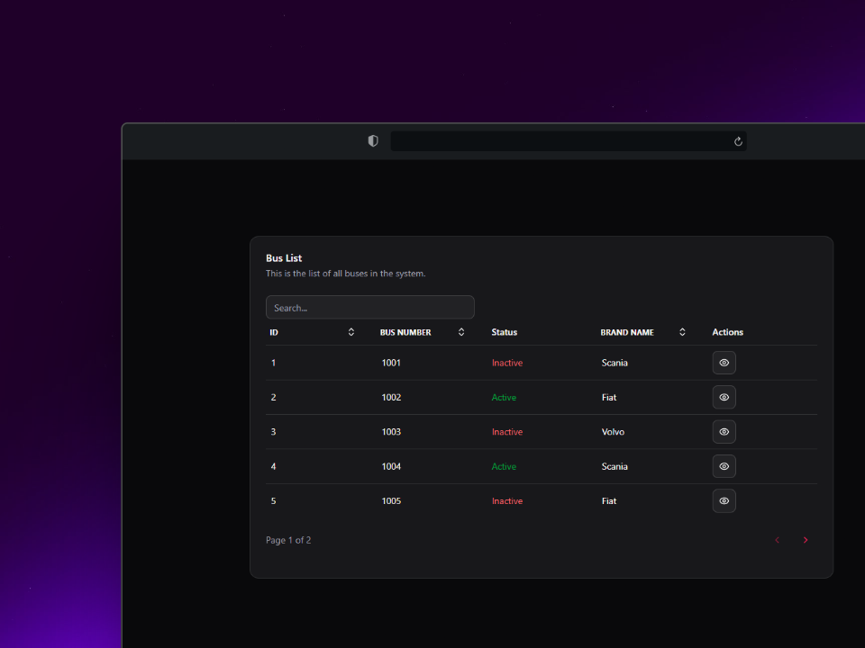

# 🚌 Bus Management App

<div align="center">

</div>

## 📌 About the Project

This is a **Bus Management System** designed to streamline the administration and visualization of buses, ideal for transport companies or booking platforms. Built with a modern tech stack, it supports paginated listings and a clean UI/UX.

## 🛠️ Tech Stack

<div align="center">


</div>

## 🚀 Features

✅ **Paginated Bus Listing**  
✅ **Bus Details View**  
✅ **Responsive UI** with Tailwind CSS  
✅ **Integrated API with Spring Boot**  
✅ **Clean Code Structure & React Best Practices**  

## 🏗️ Installation & Setup

```bash
# Clone the repository
git clone https://github.com/Samuelsf22/bus-frontend.git

# Navigate to the project directory
cd bus-frontend

# Install dependencies
npm install

# Start the development server
npm run dev
```

## 🔗 Backend Connection

This frontend application is designed to work with a backend built using **Spring Boot**.  
If you want to test the full functionality, including bus management, pagination, and CRUD operations, you need to set up the backend service.

👉 **Backend Repository:** [Bus Backend (Spring Boot)](https://github.com/Samuelsf22/bus-backend)
